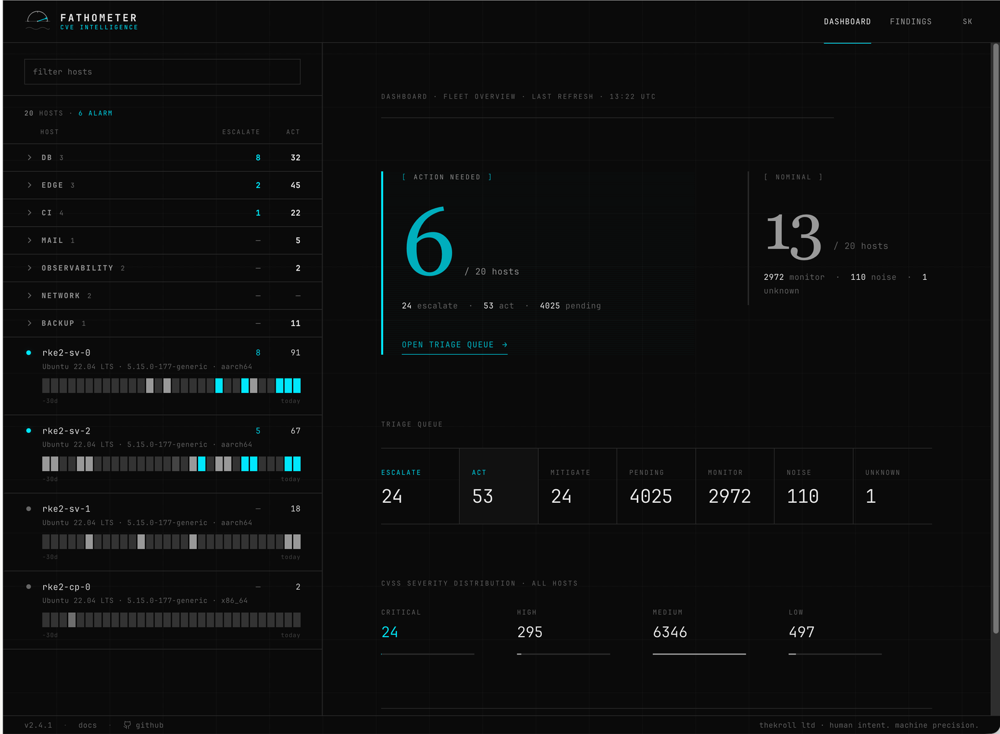

<h1 align="center">Fathometer — CVE Intelligence</h1>

<p align="center">
  Self-hosted CVE intelligence for the <strong>root servers you run yourself</strong>.<br>
  Agents run Trivy on each host, Fathometer judges every finding in context with an
  LLM, and surfaces only the ones that actually need you.<br>
  Think uptime-kuma, but for CVEs on running servers.
</p>

<p align="center">
  <a href="ARCHITECTURE.md">Full spec</a> •
  <a href="#install-fathometer">Install</a> •
  <a href="#features">Features</a>
</p>

<p align="center">
  
</p>

## Features

- **LLM context assessment** — every finding is judged on whether it's *actually
  exploitable on that host*, not on raw CVSS. CVSS, EPSS and KEV feed in as
  weights, never as the verdict.
- **Two-tier triage** — only **Act** and **Escalate** reach you; *Watch* and
  *Noise* stay out of the way. No alarm firehose, no hundreds of "critical" CVEs
  to wade through by hand.
- **Explained downgrades** — every "not exploitable here" verdict states which
  condition is missing, so you can check the call.
- **Ask the AI in context** — a per-group assistant (the *Help* button on any
  Server-detail group) answers questions about that exact host and package
  group: risk, patch order, exploit status, whether a defer is worth it. It's
  given a focused snapshot — the most important findings of the group plus an
  aggregate of the rest, not a raw dump — so replies stay fast and to the point.
- **Agent push model** — lightweight agents run Trivy on each host and push
  results; Fathometer never needs credentials to your servers and works
  air-gapped.
- **uptime-kuma-style overview** — a calm fleet view with per-host heartbeat
  history, not a metrics dashboard.
- **One-command onboarding** — register or remove a host with a single root
  command (daily systemd timer, cron fallback).
- **Self-hosted & single-user** — your scan data never leaves your
  infrastructure. Built for the operator who runs the boxes — no email / Discord
  / webhook noise by design.

### Three pages, that's it

Fathometer's entire UI is deliberately three surfaces — no sprawling menus, no
dashboards-of-dashboards:

1. **Dashboard** — fleet overview: what needs action now, the triage queue, and
   CVSS severity across all hosts.
2. **Server detail** — the per-host triage workspace: every finding for one
   host, with the reasoning behind each verdict.
3. **Findings** — the cross-host explorer: search and filter a single CVE or
   package across your whole fleet.

## Motivation

There are plenty of tools for container images, Kubernetes clusters and CI
pipelines. Keeping the handful of **plain root servers** you own quietly under
control — so you can sleep — is the gap Fathometer fills.

A single root server easily spits out hundreds of CVEs, almost none exploitable
in *your* setup. Wading through that by hand burns hours and trains you to ignore
the alarms. Fathometer exists to cut that list down to the few findings that
actually matter on your hosts.

It's a pragmatic everyday tool, **not infallible**, and does not replace
enterprise vulnerability management — but it beats blindly applying every distro
patch or burning hours on unexploitable findings.

## How it scores

Fathometer rates every finding on two axes and places it in one of four tiers.

**Axis 1 — is it exploitable on this host?** All three must hold:

- **Reachable** — can an attacker even get to the service?
- **Code path** — does this deployment actually run the vulnerable code?
- **Preconditions** — can the attacker meet what the exploit needs (auth, config, input)?

Miss even one and the CVSS score is irrelevant — it isn't exploitable here.
CVSS, EPSS and KEV feed in as *weights*, never as the verdict.

**Axis 2 — what's the damage?** From code execution / takeover, through data
theft and tampering, down to a mere service crash (DoS).

That yields four tiers:

- **Escalate** — exploitable *and* severe (takeover, data loss). Act now.
- **Act** — exploitable but limited damage, or severe but only plausibly
  reachable. Patch in the normal cycle.
- **Watch** — present but not reachable here (e.g. feature disabled), despite a
  high score.
- **Noise** — the component doesn't even run on this host (just sits there as a file).

Every downgrade states which condition is missing, so you can check the call.
Pure DoS never auto-escalates — worst case is a restart.

## What the LLM costs

Surprisingly little. Fathometer judges each finding once and caches the verdict,
so you only pay the LLM for *new* findings — not for every scan. With an
open-weights model like **`gpt-oss-120b`** on a commodity inference provider,
assessing thousands of findings lands in the **single-digit cent** range, and a
typical day of categorising and scoring the handful of *new* findings costs
**around one cent**.

You bring your own OpenAI-compatible endpoint and key, so you stay in control of
the provider and the spend. Any model that speaks the OpenAI protocol works;
`gpt-oss-120b` is a good price/quality default.

## Install Fathometer

Fathometer keeps the moving parts small. There are three ways to run it.

<details open>
<summary><strong>1. docker-compose</strong> — recommended today</summary>

<br>

The supported path right now. Brings up the app, a PostgreSQL 17 database, and
the LLM worker. Put a reverse proxy (Caddy, nginx or Traefik) in front for TLS —
the app speaks plain HTTP on port 8000 and is **not** meant to face the internet
directly.

```bash
cp .env.example .env
# Generate the two required secrets and paste them into .env:
python -c "import secrets; print(secrets.token_urlsafe(48))"   # FM_ENCRYPTION_KEY
python -c "import secrets; print(secrets.token_urlsafe(48))"   # FM_SECRET_KEY
# Set FM_PUBLIC_URL to your external HTTPS URL, e.g. https://fathometer.example.com

docker compose up -d --build
curl -fsS http://localhost:8000/healthz        # expects {"status":"ok"}
```

Reverse-proxy config, TLS, the `/api/scans` IP allowlist and Postgres backups are
covered in [`ARCHITECTURE.md`](ARCHITECTURE.md) §9.

</details>

<details>
<summary><strong>2. Kubernetes</strong> — for the brave</summary>

<br>

Run the app and Postgres as you would any Flask + DB workload and let your
ingress controller terminate TLS. Unlikely to be most people's choice, but
nothing in Fathometer stands in the way.

</details>

<details>
<summary><strong>3. Omnibus single container</strong> — <em>roadmap</em></summary>

<br>

A single self-contained image (app + database in one container, uptime-kuma
style, à la GitLab Omnibus) for the simplest possible setup. **Not available
yet** — planned, not shipped. Use docker-compose until then.

</details>

## Add a server

Once Fathometer is reachable over HTTPS, register each root server with a single
command run as root. It installs Trivy and the agent, registers the host with
your master key (asked interactively), verifies Trivy against its official
release, and sets up a daily scan timer (systemd, cron fallback).

```bash
sudo bash <(curl -fsSL https://fathometer.example.com/install.sh)
```

Re-running the same command updates an existing host and skips the master-key
prompt. For unattended provisioning (Ansible, cloud-init), pass
`FM_UNATTENDED=1` plus `FM_MASTER_KEY` / `FM_SERVER_NAME` as
environment variables.

Supported: Debian/Ubuntu, RHEL family (AlmaLinux, Rocky, Fedora, Amazon, Oracle),
SUSE — on `x86_64` and `aarch64`. Alpine/OpenRC and container hosts are
deliberately unsupported.

## Remove a server

To uninstall the agent from a host, run the uninstaller it dropped at install
time (works air-gapped, no backend needed):

```bash
sudo /opt/fathometer/bin/fathometer-uninstall.sh
```

Or, symmetric to the installer, over the network:

```bash
sudo bash <(curl -fsSL https://fathometer.example.com/uninstall.sh)
```

It removes `/opt/fathometer`, `/etc/fathometer` (config + API key), the systemd
timer/service (or cron entry), and the Trivy cache. Pass `--keep-cache` to keep
the Trivy DB, or `-y` / `FM_UNATTENDED=1` to skip the confirmation prompt. This
is local-only — the host stays listed in the dashboard until you delete it
there.

## More

- [`ARCHITECTURE.md`](ARCHITECTURE.md) — the spec: deployment detail, reverse-proxy
  and TLS, security model, data model, scoring internals.
- `docs/decisions/` — architecture decision records (ADRs).

## License

Fathometer is licensed under the Apache License, Version 2.0. See
[`LICENSE`](LICENSE) for the full text and [`NOTICE`](NOTICE) for attribution.
Third-party dependency licenses — including the LGPL-3.0 notice for psycopg —
are listed in [`THIRD-PARTY-NOTICES.md`](THIRD-PARTY-NOTICES.md).

Copyright 2026 [THEKROLL LTD](https://thekroll.ltd).

---

<p align="center">
  <sub><a href="https://thekroll.ltd">THEKROLL LTD</a> · human intent. machine precision.</sub>
</p>
