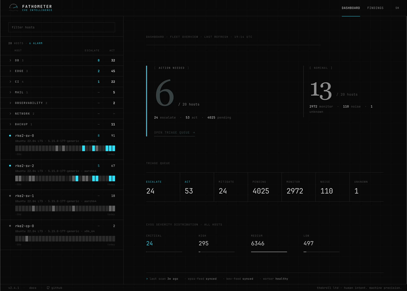
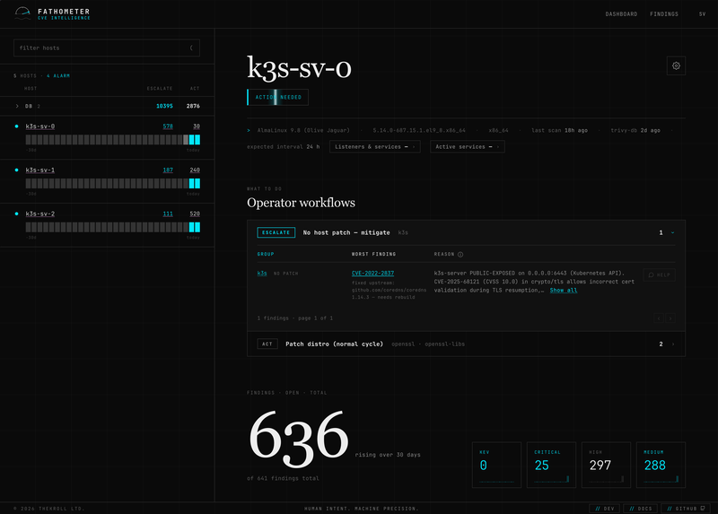
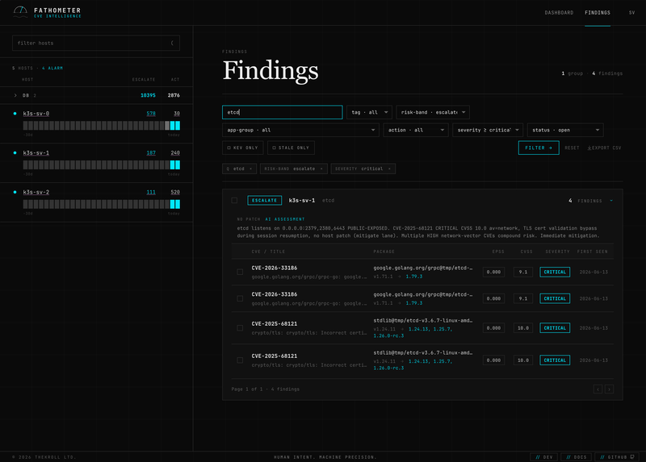
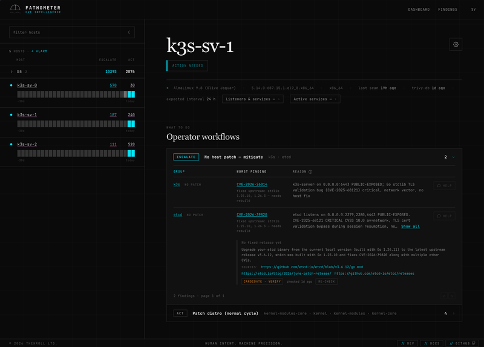
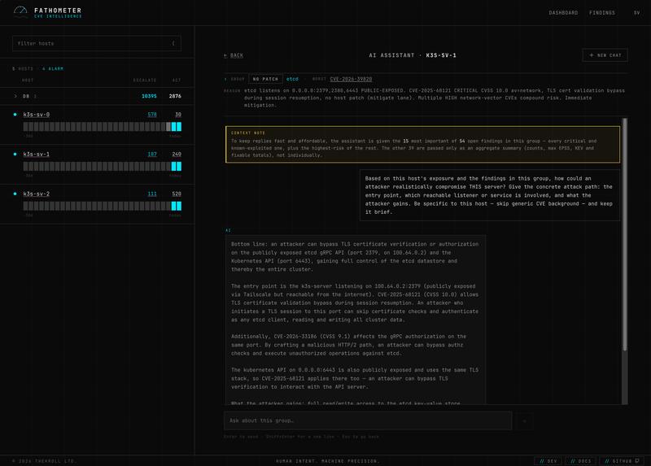

<h1 align="center">Fathometer — CVE Intelligence</h1>

<p align="center">
  Self-hosted CVE intelligence for the <strong>root servers you run yourself</strong>.<br>
  Agents run Trivy on each host, Fathometer judges every finding in context with an
  LLM, and surfaces only the ones that actually need you.<br>
  Think uptime-kuma, but for CVEs on running servers.
</p>

<p align="center">
  <a href="https://github.com/THEKROLL-LTD/SecScanUI/actions/workflows/ci.yml"></a>
  <a href="https://github.com/THEKROLL-LTD/SecScanUI/tags"></a>
  
  <a href="https://github.com/astral-sh/ruff"></a>
  
  <a href="LICENSE"></a>
</p>

<p align="center">
  <a href="#is-this-for-you">Is this for you?</a> •
  <a href="#features">Features</a> •
  <a href="#what-the-ai-does">What the AI does</a> •
  <a href="#how-it-scores">How it scores</a> •
  <a href="#built-to-last">Engineering</a> •
  <a href="#install-fathometer">Install</a> •
  <a href="ARCHITECTURE.md">Full spec</a>
</p>

<p align="center">
  <strong>Three pages, that's it.</strong> A fleet dashboard, a per-host triage
  workspace, and a cross-host findings explorer — no sprawling menus, no
  dashboards-of-dashboards.
</p>

<p align="center">
  
</p>

<p align="center">
  <a href="docs/images/server-detail.png"></a>
  &nbsp;
  <a href="docs/images/findings.png"></a>
  &nbsp;
  <a href="docs/images/ai-upstream-check.png"></a>
  &nbsp;
  <a href="docs/images/ai-chat.png"></a>
</p>

<p align="center"><sub>Server detail · Findings · Upstream check · CVE chat — click to enlarge</sub></p>

## Is this for you?

**Built for you if you:**

- run a handful of **plain root servers / VPSes** you administer yourself;
- want to know which of the hundreds of CVEs a host reports *actually matter on
  that host*, not in the abstract;
- want a calm, **self-hosted, single-operator** tool — no SaaS, no account, no
  data leaving your infrastructure, air-gap-friendly.

**Look elsewhere if you:**

- scan **container images, Kubernetes clusters, or CI pipelines** — use Trivy /
  Grype directly or a platform built for that;
- need **multi-user RBAC, SSO, or notifications** (email / Slack / webhooks);
- want enterprise vulnerability management with SLAs, ticketing and mobile
  dashboards.

### At a glance

| | |
|---|---|
| **Stack** | Python 3.14 · Flask · PostgreSQL 17 · HTMX + Alpine.js · plain CSS |
| **Scanner** | Trivy filesystem scan, lightweight agent push model |
| **LLM** | any OpenAI-compatible endpoint — bring your own key |
| **Deploy** | docker-compose (Kubernetes possible; omnibus image on the roadmap) |
| **Model** | single-user · self-hosted · runs air-gapped |
| **License** | Apache-2.0 |

## Features

- **Two-tier triage** — only **Act** and **Escalate** reach you; *Watch* and
  *Noise* stay out of the way. No alarm firehose, no hundreds of "critical" CVEs
  to wade through by hand.
- **Real patches, not phantom ones** — Fathometer tells apart a fix you can
  *actually apply* (`dnf`/`apt upgrade` will pull it) from one that only exists
  upstream inside a statically-linked binary (Go, Rust, Java) and needs a vendor
  rebuild. It resolves each binary to its owning package and checks your host's
  repos, so it never tells you to "apply the update" for a patch your package
  manager doesn't have.
- **Agent push model** — lightweight agents run Trivy on each host and push
  results; Fathometer never needs credentials to your servers and works
  air-gapped.
- **uptime-kuma-style overview** — a calm fleet view with per-host heartbeat
  history, not a metrics dashboard.
- **One-command onboarding** — register or remove a host with a single root
  command (daily systemd timer, cron fallback).
- **Self-hosted & single-user** — your scan data never leaves your
  infrastructure. Built for the operator who runs the boxes — no email / Discord
  / webhook noise by design.

## What the AI does

Fathometer puts an LLM to work on exactly **three** jobs. Each one brings *your*
OpenAI-compatible endpoint and key, each one stays in its lane, and none of them
ever silently overrides you — the AI advises, you decide.

### 1 · The context reviewer

Every finding is read by the reviewer, which asks the questions a human triager
would: is this **reachable** on this host, does the deployment actually run the
**vulnerable code path**, can an attacker meet the **preconditions** — and how
bad is the damage if they do? CVSS, EPSS and KEV feed in as *weights*, never as
the verdict. The result is one of four tiers — **Escalate · Act · Watch ·
Noise** — and every downgrade states *which* condition is missing, so you can
check the call. Each verdict is cached, so you only ever pay the LLM for *new*
findings. [How the scoring works in detail →](#how-it-scores)

### 2 · The agentic upstream check &nbsp;<sub>(opt-in)</sub>

For statically-linked binaries (Go, Rust, Java) and hand-rolled installs
(Ansible, GitHub releases), your host's package manager simply can't tell you
whether a fix exists yet. Press one button and an agent goes and looks for you:
it searches the project's latest releases, reads the build manifest (e.g. the
`go.mod` toolchain) and answers in one line whether a fixed build exists — and
which version. The manual changelog-and-`go.mod` digging, done for you. It is
**advisory only** (it never flips a risk band on its own), runs **only when you
ask** (never in the scan path), and is **off by default**. Bring your own search
backend — self-hosted SearXNG, Tavily, Firecrawl, … — and air-gapped
deployments just leave the container out.

### 3 · The CVE chat

Sometimes you just want to talk it through. The **Help** button on any package
group opens a chat scoped to that exact host and group: ask it to explain the
**attack vector**, the realistic blast radius, what to patch first, or whether
deferring is safe. It answers from a focused snapshot — the group's most
important findings plus an aggregate of the rest, not a raw dump — so replies
stay fast and grounded in *your* host, not generic CVE boilerplate.

### What it costs

Surprisingly little. Each finding is judged once and the verdict is cached, so
you only pay the LLM for *new* findings, not for every scan. With an
open-weights model like **`gpt-oss-120b`** or **`deepseek-v4-flash`** on a
commodity inference provider, assessing thousands of findings lands in the
**single-digit cent** range, and a typical day of *new* findings costs **about a
cent**. You bring your own OpenAI-compatible endpoint and key, so you stay in
control of the provider and the spend.

## Motivation

There are plenty of tools for container images, Kubernetes clusters and CI
pipelines. Keeping the handful of **plain root servers** you own quietly under
control — so you can sleep — is the gap Fathometer fills.

A single root server easily spits out hundreds of CVEs, almost none exploitable
in *your* setup. Wading through that by hand burns hours and trains you to ignore
the alarms. Fathometer exists to cut that list down to the few findings that
actually matter on your hosts.

It's a pragmatic everyday tool, **not infallible**, and does not replace
enterprise vulnerability management — but it beats blindly applying every distro
patch or burning hours on unexploitable findings.

## How it scores

Fathometer rates every finding on two axes and places it in one of four tiers.

**Axis 1 — is it exploitable on this host?** All three must hold:

- **Reachable** — can an attacker even get to the service?
- **Code path** — does this deployment actually run the vulnerable code?
- **Preconditions** — can the attacker meet what the exploit needs (auth, config, input)?

Miss even one and the CVSS score is irrelevant — it isn't exploitable here.
CVSS, EPSS and KEV feed in as *weights*, never as the verdict.

**Axis 2 — what's the damage?** From code execution / takeover, through data
theft and tampering, down to a mere service crash (DoS).

That yields four tiers:

- **Escalate** — exploitable *and* severe (takeover, data loss). Act now.
- **Act** — exploitable but limited damage, or severe but only plausibly
  reachable. Patch in the normal cycle.
- **Watch** — present but not reachable here (e.g. feature disabled), despite a
  high score.
- **Noise** — the component doesn't even run on this host (just sits there as a file).

Every downgrade states which condition is missing, so you can check the call.
Pure DoS never auto-escalates — worst case is a restart.
## Built to last

Fathometer is built like infrastructure you'd trust with your own servers — not
a weekend prototype:

- **Tested.** 2,950+ pure-unit tests run green on every change, with a coverage
  floor enforced in CI. The full lint → type-check → test gate runs on every push
  and pull request (the CI badge above).
- **Typed, end to end.** `mypy --strict` across the application, Pydantic v2 and
  SQLAlchemy 2.x throughout. Lint and formatting are enforced with Ruff.
- **Documented decisions.** 60+ architecture decision records in
  [`docs/decisions/`](docs/decisions/) capture every non-trivial choice and why
  it was made — nothing important is left to guesswork.
- **Versioned.** Semantic Versioning with a maintained
  [`CHANGELOG.md`](CHANGELOG.md), and a single, complete spec in
  [`ARCHITECTURE.md`](ARCHITECTURE.md).
- **Security-conscious by design.** Untrusted scanner and LLM data is sanitized
  (`nh3`) and never rendered with `|safe`; LLM API keys are encrypted at rest
  (Fernet), secrets hashed with Argon2, endpoints rate-limited, and the opt-in
  outbound research path is SSRF-guarded. The full threat model lives in
  [`ARCHITECTURE.md`](ARCHITECTURE.md).

## Install Fathometer

Fathometer keeps the moving parts small. There are three ways to run it.

<details open>
<summary><strong>1. docker-compose</strong> — recommended today</summary>

<br>

The supported path right now. Brings up the app, a PostgreSQL 17 database, and
the LLM worker. Put a reverse proxy (Caddy, nginx or Traefik) in front for TLS —
the app speaks plain HTTP on port 8000 and is **not** meant to face the internet
directly.

```bash
cp .env.example .env
# Generate the two required secrets and paste them into .env:
python -c "import secrets; print(secrets.token_urlsafe(48))"   # FM_ENCRYPTION_KEY
python -c "import secrets; print(secrets.token_urlsafe(48))"   # FM_SECRET_KEY
# Set FM_PUBLIC_URL to your external HTTPS URL, e.g. https://fathometer.example.com

docker compose up -d --build
curl -fsS http://localhost:8000/healthz        # expects {"status":"ok"}
```

Reverse-proxy config, TLS, the `/api/scans` IP allowlist and Postgres backups are
covered in [`ARCHITECTURE.md`](ARCHITECTURE.md) §9.

</details>

<details>
<summary><strong>2. Kubernetes</strong> — for the brave</summary>

<br>

Run the app and Postgres as you would any Flask + DB workload and let your
ingress controller terminate TLS. Unlikely to be most people's choice, but
nothing in Fathometer stands in the way.

</details>

<details>
<summary><strong>3. Omnibus single container</strong> — <em>roadmap</em></summary>

<br>

A single self-contained image (app + database in one container, uptime-kuma
style, à la GitLab Omnibus) for the simplest possible setup. **Not available
yet** — planned, not shipped. Use docker-compose until then.

</details>

## Configure the LLM provider — required first

Fathometer ships **without** a model. The context reviewer is the engine of the
whole tool, so once the app is up, your **first step** is to point it at an LLM:
open **Settings → LLM provider**, set the OpenAI-compatible base URL, paste your
API key (encrypted at rest), and pick a model. **Until a provider is configured,
the reviewer can't run and no findings get judged** — the app comes up but stays
idle.

Any endpoint that speaks the OpenAI protocol works (DeepInfra, your own
vLLM/Ollama, …); see [What the AI does](#what-the-ai-does) for model and cost
guidance.

## Add a server

Once Fathometer is reachable over HTTPS, register each root server with a single
command run as root. It installs Trivy and the agent, registers the host with
your master key (asked interactively), verifies Trivy against its official
release, and sets up a daily scan timer (systemd, cron fallback).

```bash
sudo bash <(curl -fsSL https://fathometer.example.com/install.sh)
```

Re-running the same command updates an existing host and skips the master-key
prompt. For unattended provisioning (Ansible, cloud-init), pass
`FM_UNATTENDED=1` plus `FM_MASTER_KEY` / `FM_SERVER_NAME` as
environment variables.

Supported: Debian/Ubuntu, RHEL family (AlmaLinux, Rocky, Fedora, Amazon, Oracle),
SUSE — on `x86_64` and `aarch64`. Alpine/OpenRC and container hosts are
deliberately unsupported.

### Tuning the host scan

The agent scans the live root filesystem (`trivy rootfs /`) so statically built
host binaries (k3s, tailscale, in-house Go/Java tools) are captured. On a host
running a container runtime it **excludes all container-runtime content** by
default — both the unpacked image layers/snapshots *and* the live running-container
filesystems. This covers Docker, podman/CRI-O, and every containerd-based
Kubernetes distribution (k3s, RKE2, k0s, MicroK8s, standalone containerd),
regardless of where the runtime's data-root lives. Container-image scanning is out
of scope for Fathometer, so **CVEs inside your containers/pods are not reported
here** — use a dedicated image scanner for those. Host OS packages and host
binaries (including the etcd/containerd versions compiled into the k3s host binary)
live outside the runtime and are still scanned in full.

Two environment variables tune this (set them in the agent's systemd unit /
environment):

| Variable | Default | Purpose |
|---|---|---|
| `FM_SCAN_SKIP_DIRS` | _(empty)_ | Comma-separated absolute paths **appended** to the built-in skip list. Use it for a Docker `data-root` or podman `graphroot` relocated via `daemon.json` / `storage.conf` to a non-default path — those are not auto-discovered. |
| `FM_SCAN_TIMEOUT` | `5m` | Explicit `--timeout` for the `rootfs` scan. |

> If a scan still exceeds 5 minutes after the built-in skips, the fix is almost
> always to **exclude more** (add the offending tree to `FM_SCAN_SKIP_DIRS`), not
> to raise `FM_SCAN_TIMEOUT`. A blown-up tree is usually accidental image-layer
> scanning leaking back in. Raise the timeout only for a host that genuinely has a
> large *in-scope* tree.

## Remove a server

To uninstall the agent from a host, run the uninstaller it dropped at install
time (works air-gapped, no backend needed):

```bash
sudo /opt/fathometer/bin/fathometer-uninstall.sh
```

Or, symmetric to the installer, over the network:

```bash
sudo bash <(curl -fsSL https://fathometer.example.com/uninstall.sh)
```

It removes `/opt/fathometer`, `/etc/fathometer` (config + API key), the systemd
timer/service (or cron entry), and the Trivy cache. Pass `--keep-cache` to keep
the Trivy DB, or `-y` / `FM_UNATTENDED=1` to skip the confirmation prompt. This
is local-only — the host stays listed in the dashboard until you delete it
there.

## Documentation & contributing

- [`ARCHITECTURE.md`](ARCHITECTURE.md) — the spec: deployment detail, reverse-proxy
  and TLS, security model, data model, scoring internals.
- [`CHANGELOG.md`](CHANGELOG.md) — what changed in each release.
- [`docs/decisions/`](docs/decisions/) — architecture decision records (ADRs).
- [`CONTRIBUTING.md`](CONTRIBUTING.md) — how to propose changes (a CLA applies).

## License

Fathometer is licensed under the Apache License, Version 2.0. See
[`LICENSE`](LICENSE) for the full text and [`NOTICE`](NOTICE) for attribution.
Third-party dependency licenses — including the LGPL-3.0 notice for psycopg —
are listed in [`THIRD-PARTY-NOTICES.md`](THIRD-PARTY-NOTICES.md).

Copyright 2026 [THEKROLL LTD](https://thekroll.ltd).

---

<p align="center">
  <sub><a href="https://thekroll.ltd">THEKROLL LTD</a> · human intent. machine precision.</sub>
</p>
